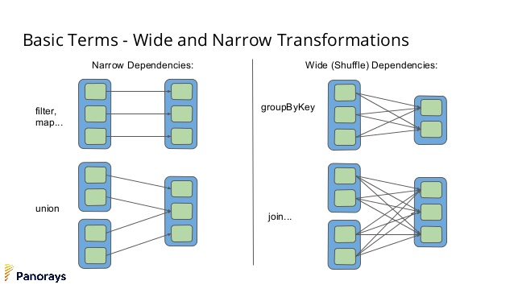

# Spark2 프로그래밍

## 01. 스파크소개
### 빅데이터 정의
다양한 형태를 지닌 대량 데이터가 빠른속도로 쌓이고 있다면 이를 빅데이터라고 부를 수 있다.
2001년 가트너의 더그레이니는 빅데이터를 크기, 다양성, 속도로 정의하였다.

크기 (Voluem)
데이터의 크기 측면에서 볼 때 빅데이터는 대량의 데이터를 처리한다는 특성을 지니고 있음.
이때 말하는 크기는 기준이 정해진 것이 아니라 기존에 보유하고 있던 데이터 크기보다 커지므로 기존 서버에서 처리 할 수 없는 크기를 말함.

다양성 (Variety)
데이터베이스에 저장된 전통적인 데이터외 처리로그, 액션 로그 등 모든 데이터가 빅데이터 후보가 될수있음.

속도 (Velocity)
데이터의 증가가 빠른속도로 진행 되어서 이에 부합하는 빠른 데이터 처리 기술이 필요하다는 특성을 갖고 있음.
- 특별히 어느정도 빨라야 된다는 기준은 없음.

요즘에는 가변성(Variability), 정확성(Veracity), 복잡성(Complexity), 시인성(Visibility)등로 빅데이터의 새로운 속성으로 정의하고 있다.

### 빅데이터 솔루션
빅데이터를 처리 하기 위해서는 다양한 모듈이 필요

- 데이터를 수집하는 모듈
- 수집한 데이터를 저장하고 조회하는 모듈
- 저장한 데이터를 원하는 모양으로 가공하는 모듈
- 가공한 데이터를 분석하고 리포팅할 수 있는 모듈
- 그리고 이 모든 과정을 제어 할 수 있는 워크플로우 엔진
- 마지막으로 다양한 관리 및 유틸리티 모듈

### 하둡
빅데이터를 대중적으로 알려지는데 하둡의 성공이 크다.
하둡은 분산환경의 병렬처리 프레임워크로서 분산파일시스템인 HDFS와 데이터처리를 위한 맵리듀스 프레임워크로 구성되어 있다.
2.0이후 부터는 리소스 관리 시스템인 Yarn 기반으로 구축할 수 있도록 지원하고 있다.
하둡은 여러대의 서버를 이용하나의 클러스터를 구성하며, 이렇게 클러스터로 묶인 서버의 자원을 하나의 서버처럼 사용할 수 있는 클러스터 컴퓨팅 환경을 제공한다.

### 스파크
스파크는 하둡 기반의 맵리듀스 작업기 가진 단점 (파일기반 연산, 한정된 언어지원)을 보완하기 위해 연구가 시작되었음.
하둡과 달리 메모리를 이용한 데이터 저장 방식을 제공하며, 강력한 데이터 처리함수를 제공함으로써 프로그램의 복잡도가 낮아짐. 또한 2.0 부터는 다양한 언어들을 지원.

#### 모델링
프로그램 세계에서 모델링이란 현실 세계에 존재하는 사물이나 개념을 프로그래밍 언어로 설명하는 과정.
스파크내에서 데이터를 표현하기 위해 RDD, 데이터셋, 데이터 프레임 3가지 모델을 제공.

#### RDDs (Resilient Distributed Datasets)
- 분산데이터 모델
- 병렬처리가 가능
- 일시적인 문제가 발생하더라도 스스로 복귀할 수 있는 능력을 가진 모델.
- RDD는 처음 생성후 변경되지않음

만약 RDD가 일부장애로 인해 데이터가 유실되면 스파크는 RDD가 어떤 단계를 거쳐서 데이터가 생성되었는지 생성절차를 다시 반복 수행하므로써 유실된 데이터를 다시 만들어냄.
즉, 똑같은 데이터를 가지고 있는것이 아니라 RDD 생성과정을 기억 하고 있다가 장애가 발생하면 이전에 작업을 반복 수행하면서 데이터를 복구한다.

###### RDD는 크게 3가지 방법으로 생성가능
- List와 Set같은 기존 프로그램 메모리에 생서된 데이터를 이용하는것.
```java
JavaRdd<String> rdd = sc.parallelize(Arrays.asList("a","b","c"));
```
- 로컬 파일시스템이나 HDFS같은 외부저장소 데이터를 읽어 생성
```java
JavaRdd<String> rdd = sc.textFile("path");
```
- 기존에 생성되어있는 RDD로 부터 새로운 RDD를 생성.
```java
JavaRdd<String> rdd = rdd.map(v -> v.toUpperCase());
```

###### 트랜스포메이션과 액션 
트랜스포메이션 연산이랑 어떤 RDD에 변형을 가해 새로운 RDD를 생성하는 연산.
트랜스포메이션 연산은 호출 되는 시점에 실행되는것이 아니라 액션에 해당하는 연산이 수행 될때 한꺼번에 실행된다. (자바8 Stream과 비슷하다..)
최종 실행 시점에 누적된 변환과 액션에 대한 최적의 방법을 찾아서 연산을 실행.
실제 여기서 액션 연산이란 RDD이외의 다른값 혹은 값을 반환하지 않는 연산을 의미한다.
사실 스파크에서 제공하는 RDD관련 메서드는 트랜스포메이션과 액션을 구분하지 않지만 반환타입이 RDD를 반환하면 트랜스포메이션, RDD 이외 다른값을 반환하면 액션연산이라고 보면된다.

###### narrow dependency Vs. Wide dependency
Base RDD를 새로운 RDD로 변환할때 Base RDD의 여러개의 파티션이 새로운 RDD와 관계를 맺고 있으면 넓은 의존성이라고 하고 그 반대는 좁은 의존성이라고 한다.



좌측은 좁은 의존성으로 인해 연산하는 과정에서 다른 파티션에 있는 데이터를 전혀 알 필요가 없다.
우측은 넓은 의존성으로 새로운 RDD를 구성할때 여러 파티션 정보를 알아야 한다, 즉 이 파티션이 여러 서버에 분산되어 저장되어있다면, 네트워크를 통한 이동으로인한 셔플링(한서버에서 다른서버로 네트워크를 통해 이동하는현상)이 발생한다.
* 셔플링이 많이 발생하면 성능에도 영향을 미친다.

